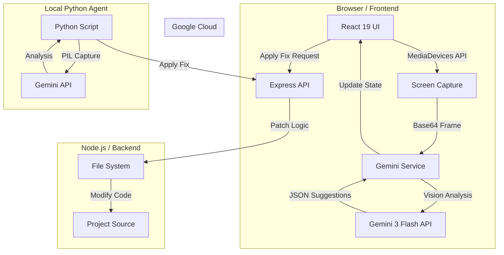

# 👁️ S.P.E.C.T.R.E
### **System for Proactive Engineering and Code Technical Real-time Evaluation**

S.P.E.C.T.R.E is a cutting-edge, real-time AI assistant designed for developers. It acts as a "second pair of eyes" that monitors your screen (IDE, Terminal, or Browser) to proactively detect errors, suggest optimizations, and autonomously apply code patches before you even realize there's a problem.

---

## 📺 Demo & Overview

S.P.E.C.T.R.E bridges the gap between static analysis and manual debugging by using **Multimodal Vision AI** to understand your entire development context.

### **The Problem**
Developers lose significant time to:
1.  **Context Switching**: Moving between the IDE, browser, and terminal to find errors.
2.  **Silent Failures**: Subtle UI bugs or performance leaks that don't trigger immediate errors.
3.  **Manual Patching**: Reading a suggestion and manually typing it out.

### **The Solution**
S.P.E.C.T.R.E solves this by:
-   **Proactive Detection**: Seeing what you see and alerting you instantly.
-   **Autonomous Fixes**: Generating and applying patches directly to your source code.
-   **Voice Assistance**: A masculine, American-accented AI voice that alerts you to high-severity issues so you don't have to look away from your code.

---

## 🏗️ System Architecture

---

## 🌟 Key Features

### 1. **Visual Intelligence (Gemini 3 Flash)**
Unlike standard linters, S.P.E.C.T.R.E "looks" at your screen. It can identify:
-   **IDE Errors**: Red squiggly lines or linter warnings you might have missed.
-   **Terminal Crashes**: Stack traces and build failures.
-   **UI/UX Breaks**: Layout shifts or broken images in your browser preview.

### 2. **Interactive Debug Timeline**
Every detected issue is archived in a searchable timeline. Click any historical event to see the **Technical Brief**, **Resolution Path**, and the **Original Patch** generated for that specific moment.

### 3. **Autonomous Patching Engine**
When S.P.E.C.T.R.E finds a fix, it doesn't just tell you—it offers to do it. Our patching engine uses fuzzy matching to find the exact lines in your source code and applies the fix with a single click.

### 4. **Voice Command & Alerts**
Features a high-quality, masculine American AI voice that provides non-intrusive, queued audio alerts. It tells you exactly what's wrong so you can keep your hands on the keyboard.

---

## 🛠️ Technical Stack

-   **Frontend**: React 19, TypeScript, Tailwind CSS 4, Lucide React, Motion (Framer Motion).
-   **Backend**: Express.js (Node.js), `tsx`.
-   **AI**: Google Gemini SDK (`@google/genai`) - `gemini-3-flash-preview`.
-   **APIs**: 
    -   `MediaDevices.getDisplayMedia()` for screen capture.
    -   `Web Speech API` for intelligent voice synthesis.
    -   `Canvas API` for real-time frame processing.

---

## 🚀 Deployment & Extensions

S.P.E.C.T.R.E is available across multiple platforms to ensure you have AI assistance wherever you code.

### 🌐 Web Application
The primary interface for S.P.E.C.T.R.E, featuring the full Mission Control dashboard, real-time screen capture, and the interactive debug timeline.
- **Live URL**: [https://ais-pre-abjm4bcghip424cuocra7o-461169291658.europe-west2.run.app](https://ais-pre-abjm4bcghip424cuocra7o-461169291658.europe-west2.run.app)

### 💻 VS Code Extension
Integrate S.P.E.C.T.R.E directly into your IDE. The extension provides a native sidebar for viewing suggestions and applying patches without leaving your workspace.
- **Installation Guide**: [View VS Code Extension README](./spectre-vscode/README.md)

### 🐍 Python Terminal Agent
For developers who prefer the command line or need to monitor non-browser environments (like a standalone terminal or a native IDE), the Python agent provides a lightweight, background monitoring service.
- **Source**: `spectre_agent.py`

---

## 🚀 How to Use

### **Step 1: Initialization**
Click the **"Initialize System"** button in the top right. This establishes the neural link between the browser and your desktop.

### **Step 2: Screen Selection**
Choose the window you want to monitor. For best results, select your **Entire Screen** or your **IDE Window**.

### **Step 3: Real-time Analysis**
As you code, S.P.E.C.T.R.E will periodically (every 5s) analyze your environment. Watch the **"Active Intelligence"** panel for live suggestions.

### **Step 4: Interactive Timeline**
If you miss an alert, check the **"Debug Timeline"** at the bottom of the sidebar. Click any entry to view the full historical data.

### **Step 5: Apply Fixes**
When a patch is available, click **"Apply Autonomous Fix"**. The backend will modify your local files instantly.

---

## 👨‍⚖️ Judge's Guide: What to Look For

When evaluating S.P.E.C.T.R.E, please notice:
1.  **Low Latency**: The speed at which Gemini 3 Flash processes visual data and returns structured JSON.
2.  **UI Density**: The "Mission Control" aesthetic that provides high information density without clutter.
3.  **Voice Interaction**: The intelligent queuing system that prevents overlapping audio alerts.
4.  **Full-Stack Integration**: The seamless flow from a visual screen capture to a physical file system modification.

---

## 🗺️ Roadmap
-   [ ] **Multi-Window Support**: Simultaneously monitor IDE and Browser.
-   [ ] **Predictive Coding**: Suggesting the next 10 lines of code based on visual context.
-   [ ] **Voice Commands**: "Spectre, fix the error in App.tsx" (Two-way voice interaction).

---

*Developed with ❤️ for the Google Gemini AI Hackathon.*
