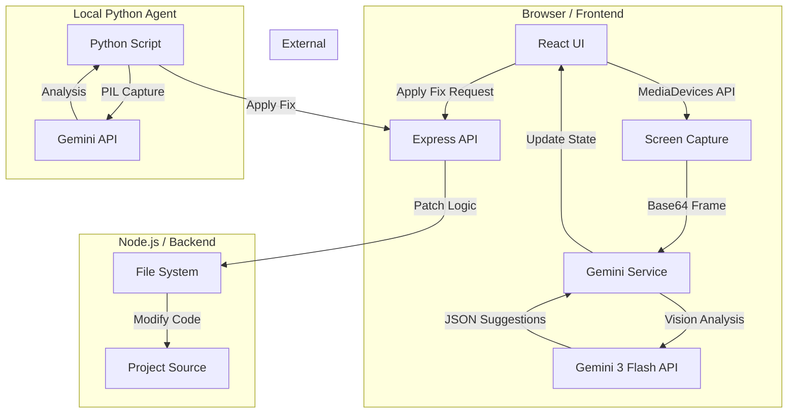

# S.P.E.C.T.R.E
### System for Proactive Engineering and Code Technical Real-time Evaluation

S.P.E.C.T.R.E is a cutting-edge, real-time AI assistant designed for developers. It monitors your screen (IDE, Terminal, or Browser) to proactively detect errors, suggest optimizations, and autonomously apply code patches.

---

## 🏗️ Architecture Diagram

---

## 📃 Project Description

### Features & Functionality
- **Real-time Monitoring**: Captures the developer's screen every 5 seconds to provide continuous feedback.
- **Multimodal Intelligence**: Uses Gemini 3 Flash's vision capabilities to "read" code, terminal outputs, and UI layouts directly from the screen.
- **Autonomous Patching**: Generates diff-style patches that can be applied to the local codebase with a single click.
- **Voice Feedback**: Provides auditory warnings for high-severity issues using the Web Speech API.
- **Debug Timeline**: Maintains a chronological log of detected issues for session tracking.
- **Terminal Agent Mode**: A standalone Python script allows S.P.E.C.T.R.E to run outside the browser, monitoring the entire desktop environment.

### Technologies Used
- **Frontend**: React 19, TypeScript, Tailwind CSS 4, Lucide React (Icons), Motion (Animations).
- **Backend**: Express.js, Node.js, `tsx` for runtime execution.
- **AI**: Google Gemini SDK (`@google/genai`) using the `gemini-3-flash-preview` model.
- **Build Tools**: Vite 6, TypeScript.
- **APIs**: MediaDevices API (Screen Capture), Web Speech API (TTS).

### Data Sources
- **Primary Input**: Live screen capture stream from the user's desktop.
- **Knowledge Base**: The Gemini 3 Flash model's internal training data for coding standards, common errors, and architectural best practices.

### Findings & Learnings
- **Video Stream Synchronization**: One of the primary challenges was handling the race condition between the MediaDevices stream initialization and the React component mounting. Implementing a `useEffect` hook to manage the `srcObject` and explicit `.play()` calls was critical for stability.
- **Indentation-Aware Patching**: Standard string replacement is insufficient for code. I learned that a robust patching system must preserve indentation and use "fuzzy matching" (trimmed line comparison) to find the correct code blocks in a dynamic environment.
- **AI Resolution Balancing**: High-resolution captures are slow to process, while low-resolution ones lose code legibility. Finding the "sweet spot" (80% scale with 0.6 JPEG quality) was essential for maintaining both speed and accuracy.
- **User Experience in AI Tools**: Providing clear indicators like "Neural Processing..." and a "Debug Timeline" helps build trust in the autonomous agent by making its "thought process" visible to the developer.

---

## 🚀 Getting Started

1. **Initialize System**: Click the "Initialize System" button in the header.
2. **Grant Permissions**: Allow the browser to share your screen (select your IDE or entire screen).
3. **Monitor**: Watch the "Active Intelligence" panel for real-time suggestions.
4. **Apply Fixes**: When a patch is available, click "Apply Autonomous Fix" to update your code instantly.

---

*Developed with ❤️ for the next generation of AI-assisted engineering.*
